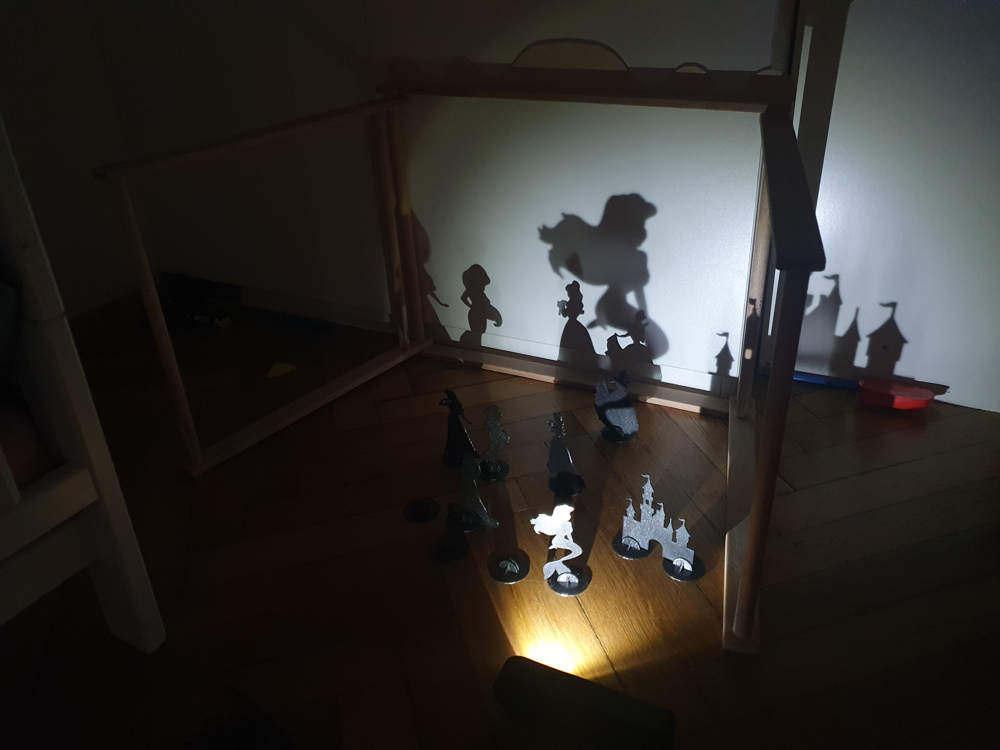

# Shadowplay Theatre

A simple light to be used for the shadowplay as well as a simple little flashlight for kids. Powered by a protected LiPo battery, comes with a USB-C charger too.  

## Controls

Has a powerful white LED and a Neopixel RGB. Two recessed buttons (bottom row) enter either the white, or the RGB mode. The top buttons control brightness. 

The middle row either enters two special modes (candlelight and lightning) for the white mode, or controls the color in the RGB mode (including a rainbow cycle). 

